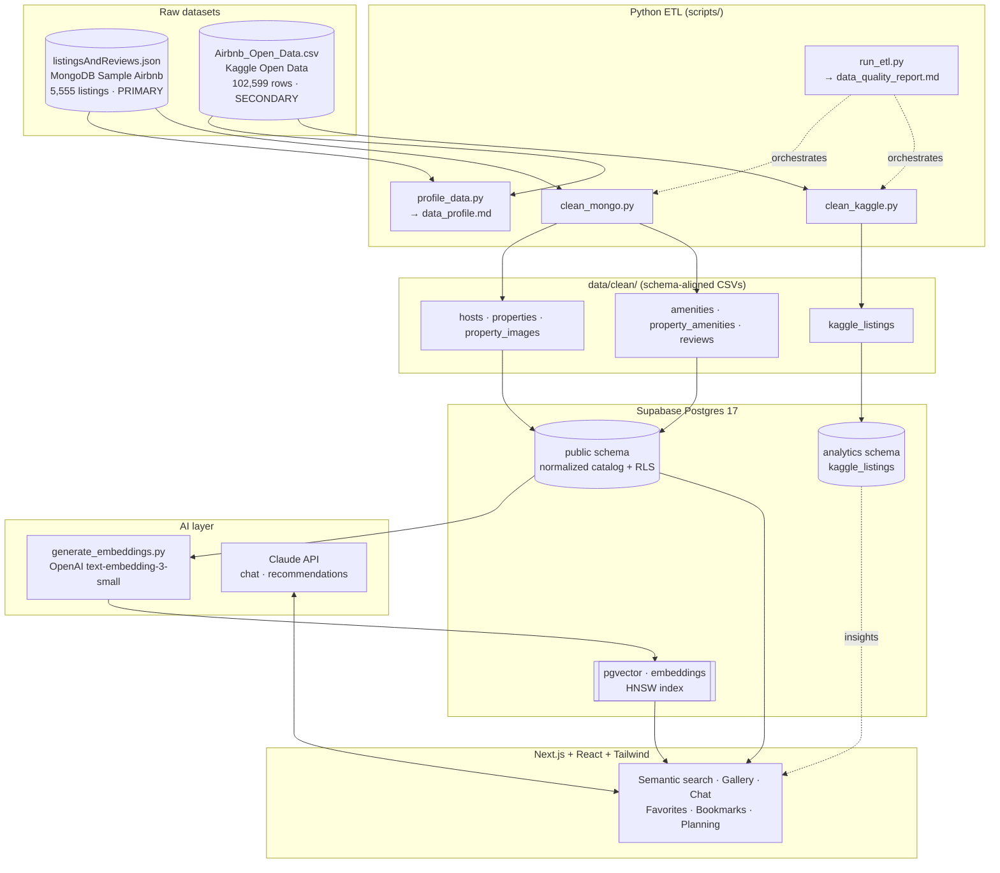

# StayLens — Architecture

## System overview

## Data flow (end to end)

1. **Profile** — `profile_data.py` scans both raw files and emits `data_profile.md`
   (types, nulls, duplicates, distributions, outliers, recommended indexes).
2. **Clean / normalize** — `run_etl.py` runs `clean_mongo.py` + `clean_kaggle.py`:
   Extended-JSON is unwrapped, nested objects flattened, arrays exploded, money/
   booleans/dates parsed, currencies normalized, and deterministic UUIDv5 keys
   assigned. Outputs six schema-aligned CSVs + `data_quality_report.md`.
3. **Migrate** — nine idempotent SQL migrations build the schema on Supabase
   (extensions → tables → indexes → RLS → vector → analytics → hardening).
4. **Import** — `import_to_supabase.py` (or `sql/import.sql`) bulk-loads the CSVs
   via `COPY` in FK-safe order.
5. **Embed** — `generate_embeddings.py` builds a text document per property and
   writes 1536-dim vectors into `embeddings` (HNSW-indexed).
6. **Serve** — the Next.js app calls `match_properties()` / `similar_properties()`
   for semantic search & recommendations, reads the catalog through RLS, and uses
   the Claude API for chat and planning.

## Key design decisions

| Decision | Rationale |
|---|---|
| **Two datasets never merged** | No reliable shared key (different id spaces, cities, eras). Kaggle isolated in `analytics` schema. |
| **UUIDv5 (deterministic) PKs** | Idempotent, re-runnable ETL; stable FKs across runs without a DB round-trip. |
| **Normalize nested JSON** | `host{}`→`hosts`, `reviews[]`→`reviews`, `amenities[]`→ dictionary + M:N; enables joins, dedup, indexing. |
| **pgvector + HNSW (cosine)** | Fast approximate semantic search at 5.5k–150k scale; `text-embedding-3-small` (1536d). |
| **RLS everywhere** | Public read on catalog; owner-scoped writes on user tables; ETL runs as service_role (bypasses RLS). |
| **earthdistance over PostGIS** | Lightweight geo-radius (`ll_to_earth`) without PostGIS overhead. |

## Tech stack

- **Frontend:** Next.js, React, Tailwind CSS
- **Backend:** Supabase (Postgres 17, Auth, Storage), pgvector, pg_trgm, earthdistance
- **AI:** OpenAI embeddings (search), Claude API (chat / recommendations / planning)
- **ETL:** Python 3.12 (pandas, numpy, psycopg2)
