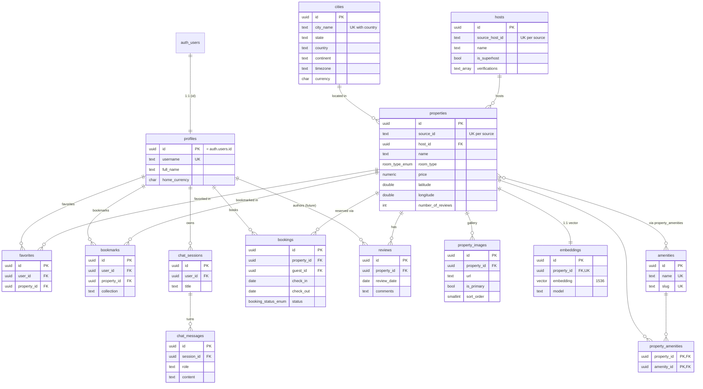

# StayLens — Entity-Relationship Diagram

The normalized catalog is built from the **primary** dataset (MongoDB Sample
Airbnb). The Kaggle dataset lives isolated in the `analytics` schema and is
therefore **not** shown as a relation here (no FKs cross into it, by design).

## Relationship summary

| Parent | Child | Cardinality | On delete |
|---|---|---|---|
| `auth.users` | `profiles` | 1 : 1 | cascade |
| `cities` | `properties` | 1 : N | set null |
| `hosts` | `properties` | 1 : N | set null |
| `properties` | `property_images` | 1 : N | cascade |
| `properties` | `reviews` | 1 : N | cascade |
| `properties` | `embeddings` | 1 : 1 | cascade |
| `properties` ↔ `amenities` | `property_amenities` | M : N | cascade |
| `profiles` | `favorites` / `bookmarks` | 1 : N | cascade |
| `profiles` | `chat_sessions` → `chat_messages` | 1 : N : N | cascade |
| `profiles` / `properties` | `bookings` | 1 : N | restrict |
